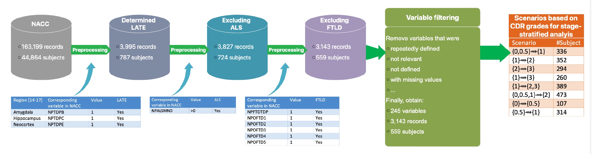
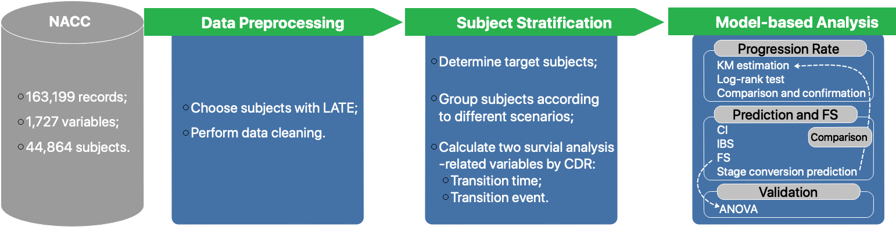
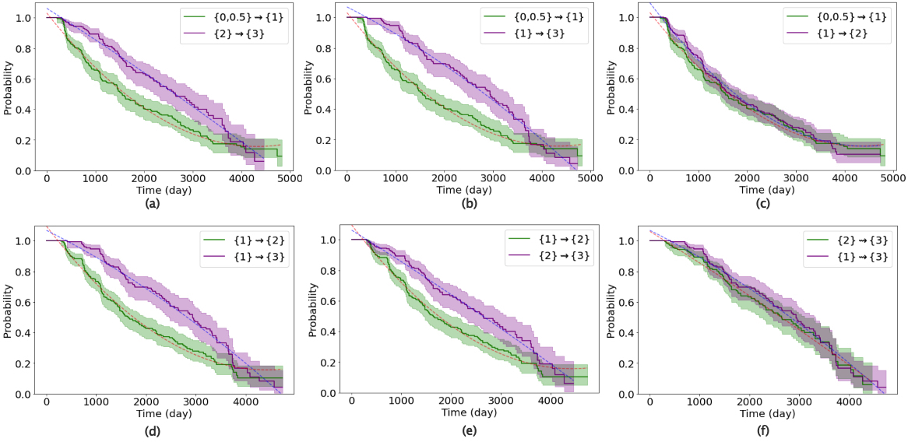
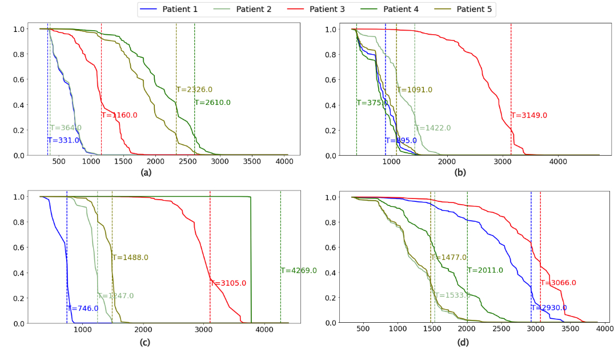
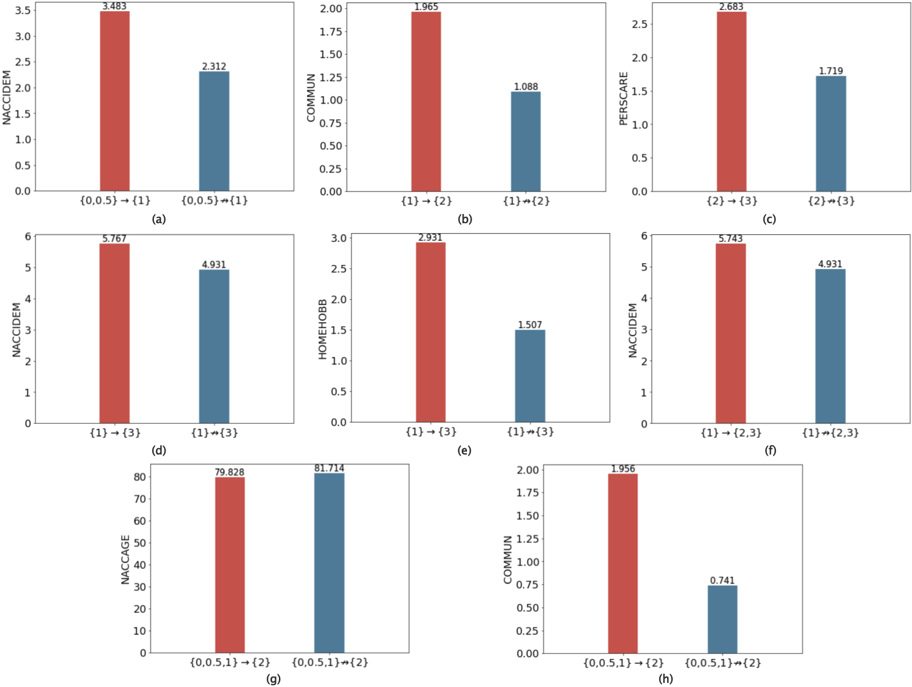

# Deep learning algorithm reveals probabilities of stage-specific time to conversion in individuals with neurodegenerative disease LATE (Alzheimer's & Dementia: Translational Research & Clinical Interventions 2022)

Paper link: https://alz-journals.onlinelibrary.wiley.com/doi/full/10.1002/trc2.12363

Dementia patients may present with different symptoms, progress at different rates at different stages of the disease, and respond differently to interventions. Therefore, it is critical to understand the heterogeneous characteristics at different stages and develop an ability to reliably assess the dementia onset and progression. In this study, we confirmed the population-level progression rates and the heterogeneity of LATE progression, and then we developed a stage-stratified approach by leveraging machine learning to probabilistically estimate the time courses of LATE stage-specific progression for different individuals. Our study has the potential to provide an individualized assessment of future time to LATE disease conversions years before their actual occurrences.

---

## Table of contents
* [Abstract](#Abstract)
* [Prerequisites](#Prerequisites)
* [Datasets](#Datasets)
* [Approach](#approach)
* [HowtoCite](#HowtoCite)
* [History](#History)
* [License](#License)
* [Contacts](#Contacts)

---

## Abstract

**INTRODUCTION**: Limbic-predominant age-related TAR DNA-binding protein 43 (TDP-43) encephalopathy (LATE) is a recently defined neurodegenerative disease. Currently, there is no effective way for prognosis of time to stage-specific future conversions at an individual level.

**METHODS**: After using the Kaplan-Meier estimation and Log-rank test to confirm the heterogeneity of LATE progression, we developed a deep learning-based approach to assess the stage-specific probabilities of time to LATE conversions for different subjects.

**RESULTS**: Our approach could accurately estimate the disease incidence and transition to next stages: the concordance index was at least 82% and the integrated Brier score was less than 0.14. Moreover, we identified the top 10 important predictors for each disease conversion scenario to help explain the estimation results, which were clinicopathologically meaningful and most were also statistically significant.

**DISCUSSION**: Our study has the potential to provide individualized assessment for future time courses of LATE conversions years before their actual occurrences.

## Prerequisites

Python 3.7.8

JupyterLab 3.2.9

## Datasets

Our approach of predictive modeling and analysis was established on the large prospective cohort, the National Alzheimers Coordinating Center (NACC) with subjects’ multiple-visit information between 2005 and 2020, which can be accessed upon request and approval by the data owner via the link https://naccdata.org/.

### Preprocessing

## Approach

Schematic illustration of our workflow for deep learning-based algorithm in analyzing the probabilities of stage-specific time to conversion in individuals with neurodegenerative disease LATE.

Some resutls:

## HowtoCite

**If you find this code useful in your research, please consider citing our work:**

Xinxing Wu, Chong Peng, Peter T. Nelson, and Qiang Cheng. Deep learning algorithm reveals probabilities of stage-specific time to conversion in individuals with neurodegenerative disease LATE. Alzheimer's & Dementia: Translational Research & Clinical Interventions, 8 (1):e12363, 2022. 

https://alz-journals.onlinelibrary.wiley.com/doi/full/10.1002/trc2.12363

---
## History

* Version 1.0 (October, 2022)

* Updated README.md (November, 2022)

---
## License

Distributed under the MIT license. See [``LICENSE``](https://github.com/xinxingwu-uk/LATE_Conversion/blob/main/LICENSE) for more information.

---

## Contacts

Xinxing Wu (xinxingwu@gmail.com) and Qiang Cheng (qiang.cheng@uky.edu)
